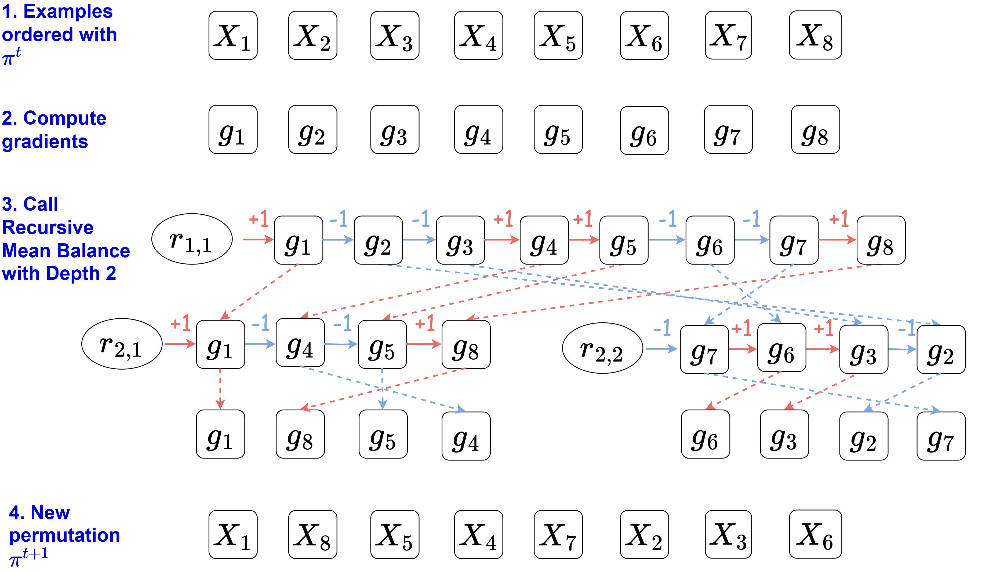
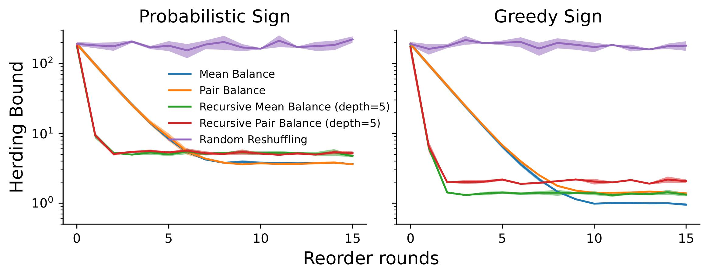

Inspired by our [CD-GraB](https://arxiv.org/pdf/2302.00845.pdf) and [GraB](https://proceedings.neurips.cc/paper_files/paper/2022/file/3acb49252187efa352a1ae0e4b066ced-Paper-Conference.pdf) paper, we implement a library named `GraB-sampler` that will obtain a good data orderings during training while compatible with PyTorch's `torch.utils.data.DataLoader`. The library could be found [here](https://github.com/garywei944/grab-sampler). Besides the `PairBalance` in CD-GraB and `MeanBalance` in GraB paper, we also develop a **recursive balancing** subroutines as follows. 

The high-level idea behind the recursive balancing algorithm is that both `PairBalance` and `MeanBalance` requires 2 components: balancing procedure and an accumulator, and we could build a tree of accumulator and call the balancing procedure recursively across each level of the accumulator tree. Each time once we obtain a sign of `+1` or `-1`, we proceed to the next level of tree and re-call the corresponding balancing subroutine.

This recursive balancing algorithm will reach O(1) herding bound in a much faster speed, as shown in the green and red lines below. 
